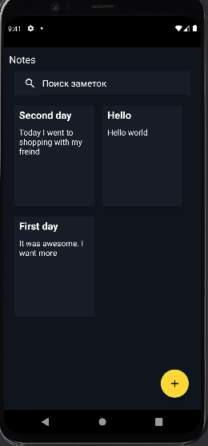
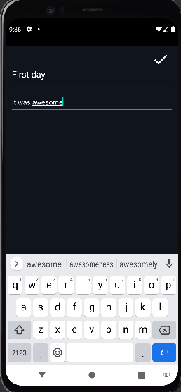
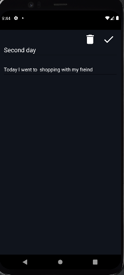
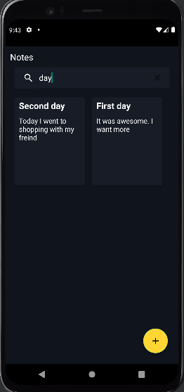

# NotesApp
Приложение Notes создана для хранения заметок и записей.
Интерфейс главного экрана выглядит следующим образом 

Интерфейс добавления новой записи

При нажатии на определенную заметку открывается новое окно, где можно редактировать или удалить.

Также приложение поддерживает поиск заметки по заголовку или содержанию.

